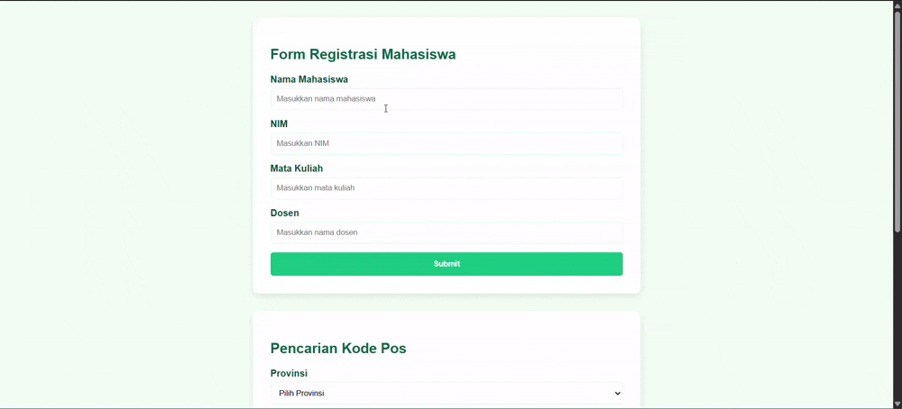

# Form Registration & Postal Code Website Documentation

# By : Abdan Hafidz (5054231021)

## Table of Contents

1. [Introduction](#introduction)
2. [Website Structure](#website-structure)
3. [Features](#features)
4. [Technical Implementation](#technical-implementation)
   - [Libraries Used](#libraries-used)
   - [Styling](#styling)
   - [Components](#components)
5. [JavaScript Algorithm Implementation](#javascript-algorithm-implementation)
   - [Autocomplete](#autocomplete)
   - [Form Validation](#form-validation)
   - [Dynamic Dropdowns](#dynamic-dropdowns)
   - [Postal Code Search](#postal-code-search)
6. [Code Explanation](#code-explanation)
7. [Future Improvements](#future-improvements)

## Introduction

This documentation covers a multi-purpose web application that contains three main components:

- Student Registration Form
- Postal Code Search Feature
- Dynamic Province-City Dropdown System

The website uses jQuery and jQuery UI for interactivity and has a clean, responsive design with a green-themed color scheme.



## Website Structure

The HTML structure consists of three main container divs:

1. **Student Registration Form** - Collects student information with validation
2. **Postal Code Search** - Allows users to search postal codes by province and city
3. **Dynamic Dropdown** - Demonstrates province-city relationship with dependent dropdowns

## Features

### Student Registration Form

- Input fields for student name, ID number, course, and lecturer
- Form validation with error messages
- Autocomplete functionality for student names
- Success alert upon successful submission

### Postal Code Search

- Province dropdown selection
- City dropdown that updates based on the selected province
- "Search" button that displays postal code information

### Dynamic Dropdowns

- Province selection dropdown
- City dropdown that dynamically updates based on the selected province

## Technical Implementation

### Libraries Used

- **jQuery 3.6.0** - For DOM manipulation and event handling
- **jQuery UI 1.13.2** - For the autocomplete functionality
- **Native JavaScript** - For additional functionality

### Styling

The website uses a custom CSS styling with:

- Green-themed color scheme (#f0fdf4, #10b981, #065f46)
- Rounded corners and subtle shadows for containers
- Responsive design elements
- Transition effects for buttons
- Error state styling for form validation

### Components

#### Form Elements

- Text inputs with placeholder text
- Dropdown selects with dynamic options
- Submit buttons with hover effects
- Error message containers
- Result display box

## JavaScript Algorithm Implementation

### Autocomplete

```javascript
// Define an array of student names for autocomplete
const daftarNama = [
  "Abdan Hafidz", "Ahmad Zaki", "Aulia Rahman", "Budi Santoso",
  "Citra Dewi", "Dian Saputra", "Eka Prasetyo", "Farah Nabila"
];

// Initialize jQuery UI autocomplete on the name field
$("#nama").autocomplete({ source: daftarNama });
```

The autocomplete feature implements a simple algorithm:

1. Define a static array of student names
2. Apply jQuery UI's autocomplete widget to the name input field
3. When a user types, the algorithm filters the array for matching names
4. Matching suggestions appear in a dropdown below the input field

### Form Validation

```javascript
$('#formReg').on('submit', function (e) {
  e.preventDefault();

  let valid = true;
  $('.error-message').html('');
  $('input').removeClass('error');

  const nama = $('#nama').val();
  const nim = $('#nim').val();
  const matkul = $('#matkul').val();
  const dosen = $('#dosen').val();

  if (!nama) {
    $('#error-nama').html('Nama Mahasiswa wajib diisi.');
    $('#nama').addClass('error');
    valid = false;
  }
  // Additional validation checks...

  if (valid) {
    alert(`Registrasi berhasil!\n\nNama: ${nama}\nNIM: ${nim}\nMata Kuliah: ${matkul}\nDosen: ${dosen}`);
    $(this)[0].reset();
  }
});
```

The form validation algorithm:

1. Prevents the default form submission
2. Resets previous error states
3. Retrieves all form field values
4. Checks each field for empty values
5. Displays error messages and highlights fields that fail validation
6. If all fields pass validation, displays a success message and resets the form

### Dynamic Dropdowns

```javascript
// Data structure for provinces and cities
const dataProvinsi = [
  { id: 1, nama: "Jawa Barat", kota: [{ id: 1, nama: "Bandung" }, { id: 2, nama: "Bekasi" }] },
  { id: 2, nama: "Jawa Timur", kota: [{ id: 3, nama: "Surabaya" }, { id: 4, nama: "Malang" }] },
  { id: 3, nama: "Bali", kota: [{ id: 5, nama: "Denpasar" }] },
];

// Populate province dropdowns
dataProvinsi.forEach(provinsi => {
  $('#provinsi, #provinsi-dinamis').append(`<option value="${provinsi.id}">${provinsi.nama}</option>`);
});

// Handle province change
$('#provinsi').on('change', function () {
  const provinsiId = $(this).val();
  if (provinsiId) {
    const provinsiData = dataProvinsi.find(p => p.id == provinsiId);
    $('#kota').empty().append('<option value="">Pilih Kota/Kabupaten</option>');
    provinsiData.kota.forEach(kota => {
      $('#kota').append(`<option value="${kota.id}">${kota.nama}</option>`);
    });
  }
});
```

The dynamic dropdown algorithm:

1. Defines a nested data structure that represents provinces containing cities
2. Populates the province dropdowns with options from the data structure
3. Sets up event listeners for when a province is selected
4. When a province changes:
   - Finds the corresponding province data from the array
   - Clears the city dropdown
   - Adds a default option
   - Populates the city dropdown with cities from the selected province

### Postal Code Search

```javascript
$('#btnCari').on('click', function () {
  const selectedCity = $('#kota option:selected').text();
  $('#kodepos').html(`<strong>Kode Pos untuk ${selectedCity}:</strong> 12345`).fadeIn();
});
```

The postal code search algorithm:

1. Listens for clicks on the search button
2. Retrieves the text of the selected city option
3. Updates the result box with a formatted message containing the city name
4. Uses a fadeIn effect to display the result

## Code Explanation

### Event-Driven Architecture

The JavaScript code uses jQuery's event-driven approach to handle user interactions:

- `$(document).ready()` ensures that all code runs after the DOM is fully loaded
- Event listeners are attached to form submissions, dropdown changes, and button clicks
- Callback functions process the events and update the UI accordingly

### Data Structures

The code uses a nested object structure to represent the hierarchical relationship between provinces and cities:

```javascript
const dataProvinsi = [
  { 
    id: 1, 
    nama: "Jawa Barat", 
    kota: [
      { id: 1, nama: "Bandung" }, 
      { id: 2, nama: "Bekasi" }
    ] 
  },
  // More provinces...
];
```

This structure allows for:

- Easy iteration through provinces for dropdown population
- Efficient filtering of cities based on the selected province
- Maintainable data organization with clear parent-child relationships

### DOM Manipulation Techniques

The code demonstrates several DOM manipulation techniques:

1. **Element Selection** - Using jQuery selectors like `$('#provinsi')`
2. **Content Updating** - Using methods like `.html()` and `.append()`
3. **Class Manipulation** - Adding/removing CSS classes with `.addClass()` and `.removeClass()`
4. **Form Handling** - Retrieving values with `.val()` and resetting forms with `[0].reset()`
5. **Animation** - Using effects like `.fadeIn()` for smooth transitions

## Future Improvements

Potential enhancements for the website:

1. **Data Persistence** - Implement local storage or backend API integration
2. **Real Postal Code API** - Replace dummy data with a real postal code API
3. **Advanced Validation** - Add pattern matching for NIM and other fields
4. **Responsive Enhancements** - Improve mobile device compatibility
5. **Accessibility Features** - Add ARIA attributes and keyboard navigation
6. **Form Submission via AJAX** - Implement asynchronous form submission
7. **Additional Fields** - Expand the registration form with more student information
8. **Multi-step Form** - Convert the registration into a step-by-step process
